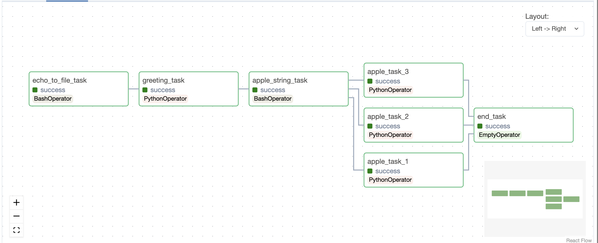

# # My Eleventh Code Review: Airflow 1

## Alex Wallace

## Description
For this project, I was tasked to create a DAG in airflow that creates a file called code_review.txt with my name, uses the file to print a greeting, and uses a random choice generator to pick three random apples from a global list present within the DAG. The tasks are as such:

task 1: echo_to_file_task - echoes my name into a file called code_review.txt.

task 2: greeting_task - takes my name from the code_review.txt file and uses it to print a greeting. 

task 3: apple_string_task - prints a string telling user we are picking three random apples from the apple list.

tasks 4, 5, and 6: apple_task_1, apple_task_2, apple_task_3 - three tasks generating a random apple that prints an f string with that apple's name. These tasks are to be run at the same time.

task 7: end_task - an empty task using EmptyOperator that concludes our DAG. 

The graph for this DAG looks like this:



Here, we can see that the first three tasks run consecutively. Then, the graph fans out into the three random apple tasks, and fans back into an empty end task that concludes our executed run. the entire DAG code can be found [here](dsa-airflow/dags/code_review.py).
 
## Setup/Installation Requirements
In order to set this up, you will need to make a directory for your file and then switch over to that directory. Then, create a virtual environment for python 3 to work in. Change into your virtual environment using source venv/bin/activate. You will need to install the requirements.txt file

```
pip install -r requirements.txt
```

After creating your virtual environment in your project directory, you will need to make sure you have docker installed. The link to the different installation options can be found [here](https://docs.docker.com/engine/install/). Once you have docker up and running, you will need to allocate atleast 4gb worth of cpu memory to the airflow docker container. To do this:
- click the gear icon on the top right to go into Settings
- click the 'Resources' tab on the left 
- Set the Memory slider to at least 4GB as shown below, then click 'Apply & Restart':

Once docker is all set up, we have to set up a folder to contain our airflow files. In your project directory, create a folder called dsa-airflow. Using your CLI (command line interface), path into your dsa-airflow folder. Then, create a logs folder, plugins folder, a dags folder, and a config folder within your dsa-airflow folder.

```bash
mkdir -p ./dags ./logs ./plugins ./config
```

You also need to create a .env in your dsa-airflow folder using 

```bash
echo -e "AIRFLOW_UID=$(id -u)" > .env
```

After completing this, you will need to fetch the docker yaml file into your dsa-airflow folder using 

```bash
curl -LfO 'https://airflow.apache.org/docs/apache-airflow/stable/docker-compose.yaml'
```

Once you have your dsa-airflow folder intact, you need to start airflow. in bash, use:

```bash
docker compose up airflow-init
```

This command runs database migrations (which moves data between databases), and creates a default user account with the login 'airflow' and the password 'airflow'. After this task has been completed (you should see an 'exited with code 0'), press ctrl+c while your CLI is open to stop airflow from running. 

Once initialized, we can start the rest of our containers with a simple

```bash
docker-compose up
```

When you have airflow running in your CLI, you will need to open a new terminal to perform any actions necessary using bash. An alternative way to power down airflow is to type 

```bash
docker compose down
```

in your usable CLI. 

Using these steps, you should have airflow talking to your local computer. In order to use the airflow CLI, go to the URL [localhost:8080/home](localhost:8080/home). From here, type in your username 'airflow' and password 'airflow' to log into the airflow UI. In this interface, you will be able to run any DAGs you have created.

## Known Bugs
No known bugs

## License
Copyright 2023 Alex Wallace

Permission is hereby granted, free of charge, to any person obtaining a copy of this software and associated documentation files (the “Software”), to deal in the Software without restriction, including without limitation the rights to use, copy, modify, merge, publish, distribute, sublicense, and/or sell copies of the Software, and to permit persons to whom the Software is furnished to do so, subject to the following conditions:

The above copyright notice and this permission notice shall be included in all copies or substantial portions of the Software.

THE SOFTWARE IS PROVIDED “AS IS”, WITHOUT WARRANTY OF ANY KIND, EXPRESS OR IMPLIED, INCLUDING BUT NOT LIMITED TO THE WARRANTIES OF MERCHANTABILITY, FITNESS FOR A PARTICULAR PURPOSE AND NONINFRINGEMENT. IN NO EVENT SHALL THE AUTHORS OR COPYRIGHT HOLDERS BE LIABLE FOR ANY CLAIM, DAMAGES OR OTHER LIABILITY, WHETHER IN AN ACTION OF CONTRACT, TORT OR OTHERWISE, ARISING FROM, OUT OF OR IN CONNECTION WITH THE SOFTWARE OR THE USE OR OTHER DEALINGS IN THE SOFTWARE.